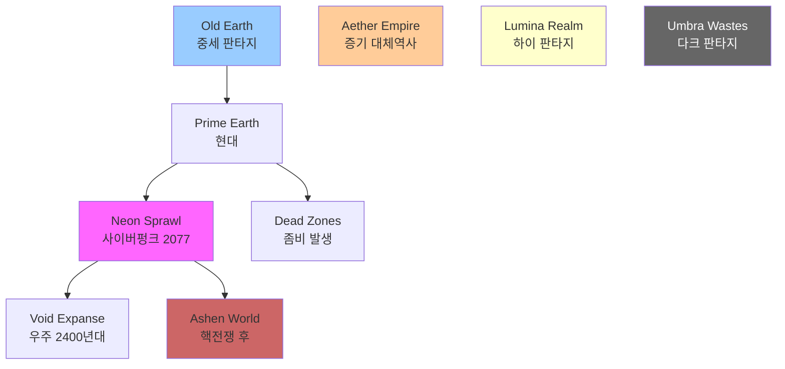

# NEXUS: 통합 세계관 구조 개요

## 세계관 컨셉: "Nexus Multiverse"

**Nexus**는 모든 세계관이 공존하는 단일하면서도 다층적인 우주입니다. 각 장르(SF, 판타지, 현대 등)는 독립된 차원 또는 시간대에 존재하며, 특정 조건 하에서 서로 교차할 수 있습니다.

### 핵심 메커니즘

**Nexus Point (넥서스 포인트)**

- 모든 차원이 교차하는 중심점
- 시공간의 균열, 차원문, 고대 유적 등으로 발현
- 레벨 디자이너는 이를 통해 크로스오버 맵 제작 가능

---

## 차원 구조 (Dimensional Framework)

### Layer 1: 물리 차원 (Physical Dimensions)

현실 법칙이 지배하는 세계들

1. **Prime Earth (기준 지구)**
   - 현대 도시, 어반 판타지
   - 시간대: 2020년대

2. **Old Earth (고대 지구)**
   - 중세 판타지, 신화 시대
   - 시간대: 기원전 ~ 중세

3. **New Frontier (개척 행성)**
   - 서부극, 디젤펑크
   - 시간대: 19세기 ~ 1940년대 대체역사

### Layer 2: 기술 차원 (Technological Dimensions)

과학기술이 극한까지 발달한 세계들

1. **Neon Sprawl (사이버펑크 메트로폴리스)**
   - 기술 디스토피아, AI 지배
   - 시간대: 2077년

2. **Aether Empire (스팀펑크 제국)**
   - 증기기관 문명, 비행선 시대
   - 시간대: 빅토리안 시대 대체역사

3. **Void Expanse (우주 오페라)**
   - 은하 간 전쟁, 외계 종족
   - 시간대: 2400년대

### Layer 3: 마법 차원 (Arcane Dimensions)

마법과 초자연이 지배하는 세계들

1. **Lumina Realm (하이 판타지)**
   - 신들의 축복, 영웅의 시대
   - 마나가 풍부한 빛의 세계

2. **Umbra Wastes (다크 판타지)**
   - 저주받은 땅, 타락과 절망
   - 마나가 오염된 어둠의 세계

### Layer 4: 붕괴 차원 (Collapse Dimensions)

문명이 멸망한 후의 세계들

1. **Ashen World (핵전쟁 폐허)**
   - 방사능 황무지, 생존자 집단
   - 시간대: 2050년 이후

2. **Dead Zones (좀비 아포칼립스)**
    - 바이러스 창궐, 인류 멸종 위기
    - 시간대: 현대 + 5년

---

## 시간축 구조 (Timeline Integration)

**직선 타임라인**: Old Earth → Prime Earth → Neon Sprawl → Void Expanse (물리적 진화)

**분기 타임라인**:

- Prime Earth → Dead Zones (바이러스 발생)
- Prime Earth → Ashen World (핵전쟁)

**평행 타임라인**: Aether Empire, Lumina Realm, Umbra Wastes (독립 차원)

---

## 세계관 간 이동 규칙

### 자연 발생 Nexus Point

- **고대 유적**: 마법 포털, 차원문
- **기술 사고**: 입자가속기 폭발, 워프 실패
- **마법 폭주**: 금지된 주문, 신의 저주

### 의도적 이동

- **과학**: 차원 이동 장치, 시간 여행 머신
- **마법**: 소환술, 평행세계 주문
- **초자연**: 선택받은 자, 예언의 아이

### 이동 제약

- 대부분의 주민은 자기 차원에 갇혀 있음
- 주인공급 캐릭터만 특별한 이유로 이동 가능
- 이동 시 능력 변화 가능 (과학 세계에서는 마법 약화 등)

---

## 톤 앤 매너 조화 원칙

각 세계관은 독립된 분위기를 가지지만, Nexus라는 큰 틀에서 조화를 이룹니다.

### 색상 팔레트 체계 (Max Pears 색채 심리학)

| 세계관 | 주 색상 | 보조 색상 | 심리 효과 |
|--------|---------|-----------|-----------|
| Neon Sprawl | 사이버 블루 | 핑크, 퍼플 | 인공적, 차갑고 화려함 |
| Aether Empire | 구리/황동 | 검은 연기 | 빅토리안, 산업혁명 |
| Lumina Realm | 금색/흰색 | 하늘색 | 신성함, 희망 |
| Umbra Wastes | 짙은 회색 | 핏빛 붉은색 | 절망, 타락 |
| Ashen World | 재색/갈색 | 녹슨 주황 | 황폐함, 생존 |
| Dead Zones | 탁한 녹색 | 썩은 갈색 | 질병, 부패 |
| Void Expanse | 우주 검정 | 성운 보라 | 광활함, 미지 |
| Prime Earth | 자연색 균형 | 도시 회색 | 현실감, 친숙함 |

### 도형 이론 적용 (Max Pears Shape Theory)

- **원형 세계**: Lumina Realm (안전한 성채), Prime Earth (광장)
- **삼각형 세계**: Neon Sprawl (뾰족한 빌딩), Umbra Wastes (날카로운 바위)
- **사각형 세계**: Aether Empire (견고한 공장), Ashen World (벙커)

---

## Sakurai 게임 디자인 원칙 적용

### 리스크와 리턴 설계

각 세계관은 명확한 게임성 특징을 가집니다:

**High Risk / High Return**

- Umbra Wastes: 강력한 적, 희귀 아이템
- Neon Sprawl: 감시 네트워크, 해킹 보상

**Low Risk / Exploration Reward**

- Lumina Realm: 안전한 탐험, 지식 습득
- Prime Earth: 일상적 위험, 스토리 진행

**Survival Tension**

- Dead Zones: 자원 부족, 생존 그 자체가 보상
- Ashen World: 방사능 위험, 안전 지대 확보

### 보상 시스템 통합

**직접 강화**: 각 세계관 고유 장비/스킬

- Neon Sprawl: 사이버웨어 업그레이드
- Lumina Realm: 마법 주문서

**간접 보상**: 세계관 간 지식/아이템 이전

- 스팀펑크 기술을 사이버펑크에 적용
- 고대 마법을 현대에서 해독

---

## 레벨 디자이너를 위한 Quick Reference

### 세계관 선택 가이드

**액션 중심 맵** → Neon Sprawl, Void Expanse, Umbra Wastes  
**탐험 중심 맵** → Lumina Realm, Aether Empire, Old Earth  
**생존 호러 맵** → Dead Zones, Ashen World  
**내러티브 중심 맵** → Prime Earth, Old Earth  
**멀티플레이 PvP** → Void Expanse, Neon Sprawl (기술 균형)  
**협동 PvE** → Dead Zones, Umbra Wastes (적 vs 플레이어)

### 크로스오버 맵 아이디어

1. **Nexus Station**: 모든 차원의 여행자들이 모이는 중립 지대
2. **Rift Wars**: 두 세계관이 충돌하는 전장 (예: 사이버펑크 vs 마법)
3. **Archive of Worlds**: 모든 역사가 기록된 초월적 도서관

---

## 다음 문서 안내

- **01_Genre_Database.md**: 각 세계관의 상세 설정 (테마, 환경, 적 유형)
- **02_Characters_Database.md**: 24명의 주인공 프로필 및 3C 특성
- **03_Scenarios_Database.md**: 48개 시나리오 개요 및 레벨 디자인 팁
- **04_Level_Design_Guide.md**: 실전 활용 프로세스 및 케이스 스터디
